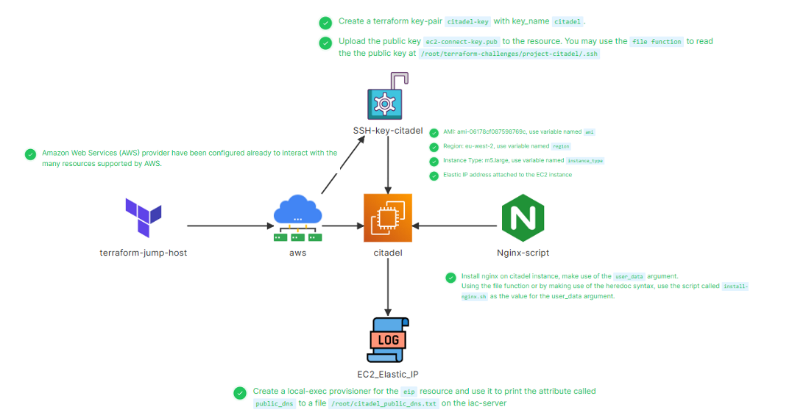

# 🚀 KodeKloud Challenge 03 - Citadel Infrastructure with Terraform

This project provisions an **EC2 instance** named **citadel** using Terraform on AWS (with LocalStack endpoints for simulation). It also attaches an **Elastic IP**, installs **Nginx** using a user-data script, and saves the public DNS of the instance to the IAC server.

---

## 📌 Architecture



### Key Components

* **Terraform Jump Host**: Executes Terraform code to manage AWS resources.
* **AWS Provider (LocalStack)**: Simulated AWS environment with endpoints mapped to `http://aws:4566`.
* **EC2 Instance (citadel)**: Ubuntu-based instance running Nginx.
* **Elastic IP**: Static IP attached to the EC2 instance.
* **Security Group**: Allows **SSH (22)** and **HTTP (80)** traffic.
* **Key Pair (citadel-key)**: SSH key for secure login.
* **Provisioner**: Writes the public DNS of the instance into a file on the IAC server (`/root/citadel_public_dns.txt`).

---

## 📂 Project Structure

```
project-citadel/
├── aws-ec2.tf        # EC2 instance definition with user_data for Nginx
├── aws-eip.tf        # Elastic IP resource with local-exec provisioner
├── aws-key.tf        # Key pair resource for SSH access
├── aws-sg.tf         # Security group (SSH + HTTP)
├── install-nginx.sh  # User data script to install and start Nginx
├── output.tf         # Outputs public DNS of EC2 instance
├── provider.tf       # AWS provider (pointing to LocalStack endpoints)
├── variables.tf      # Variable definitions (region, AMI, instance_type)
└── README.md         # Documentation
```

---

## ⚙️ Configuration Details

### Provider

* Uses **AWS provider v4.15.0**.
* Configured with **LocalStack endpoints** to simulate AWS.
* Region: `eu-west-2`.

### EC2 Instance (citadel)

* AMI: `ami-06178cf087598769c`
* Instance Type: `m5.large`
* Key Pair: `citadel-key`
* Security Group: `citadel-sg`
* User Data: `install-nginx.sh` installs and starts **Nginx**

### Elastic IP

* Attached to **citadel** EC2 instance.
* Public DNS is extracted and saved to `/root/citadel_public_dns.txt` using a `local-exec` provisioner.

### Security Group Rules

* **Ingress**:

  * SSH (22/tcp) → `0.0.0.0/0`
  * HTTP (80/tcp) → `0.0.0.0/0`
* **Egress**:

  * All traffic allowed (`0.0.0.0/0`).

---

## 🛠️ Usage

### 1️⃣ Clone the repository

```bash
git clone https://github.com/your-username/project-citadel.git
cd project-citadel
```

### 2️⃣ Initialize Terraform

```bash
terraform init
```

### 3️⃣ Validate the configuration

```bash
terraform validate
```

### 4️⃣ Apply the configuration

```bash
terraform apply -auto-approve
```

### 5️⃣ Verify resources

* Check created instance:

  ```bash
  terraform show
  ```
* Verify Nginx installation:

  ```bash
  curl http://<citadel-public-dns>
  ```
* Check saved DNS:

  ```bash
  cat /root/citadel_public_dns.txt
  ```

### 6️⃣ Destroy the resources

```bash
terraform destroy -auto-approve
```

---

## 📜 install-nginx.sh

The script used in `user_data`:

```bash
#!/bin/bash
sudo apt update -y
sudo apt install nginx -y
sudo systemctl enable nginx
sudo systemctl start nginx
```

---

## 🎯 Challenge Requirements Fulfilled

✅ Created a Terraform **key-pair** `citadel-key`.
✅ Uploaded **public key** `ec2-connect-key.pub`.
✅ Defined **EC2 instance** `citadel`.
✅ Attached **Elastic IP** to EC2.
✅ Installed **Nginx** using `install-nginx.sh`.
✅ Configured **Security Group** (SSH + HTTP).
✅ Used **local-exec** provisioner to save public DNS to `/root/citadel_public_dns.txt`.

---

## 📌 Outputs

```hcl
output "citadel_public_dns" {
  value = aws_instance.citadel.public_dns
}
```

This prints the EC2 instance DNS after `terraform apply`.

---

## 🧹 Cleanup

To avoid leftover resources, run:

```bash
terraform destroy -auto-approve
```

---

## 🏆 Conclusion

This project demonstrates how to use **Terraform** to provision an EC2 instance, attach an Elastic IP, configure security groups, install software via user-data, and automate output storage using provisioners.

It replicates **real-world infrastructure automation** with AWS services (simulated on **LocalStack**).
